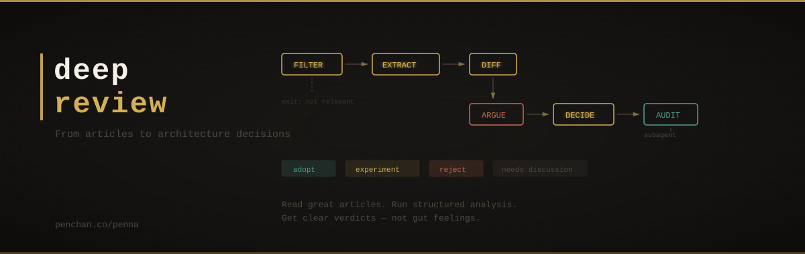

<div align="center">
  
  <br/><br/>
  <strong>From articles to architecture decisions</strong>
  <br/><br/>
</div>

---

You read a great article. New tips, better workflows, smarter prompts.

But should you actually change anything?

**deep-review** is a skill for Claude Code that answers this question. Instead
of going with your gut, it runs each recommendation through a structured
pipeline and gives you a clear verdict: **adopt**, **experiment**, **reject**,
or **needs discussion**.

## The problem

We all do this:

1. Read an exciting article
2. Think "this is brilliant, I should use this"
3. Either adopt everything (and bloat the system) or do nothing (and forget it)

The issue isn't the articles — it's that we skip the analysis. We get swayed by
who wrote it, how new it sounds, or the urge to "do something." deep-review
adds the thinking step you'd do if you had unlimited time and patience.

## How it works

Six phases. Each one builds on the last.

```
article --> FILTER --> EXTRACT --> DIFF --> ARGUE --> DECIDE --..-> AUDIT --> result
              |                                                 ^
              +-- exit: not our problem                     subagent
```

| Phase | What happens |
|-------|-------------|
| **0. Filter** | First question: "Do we even have this problem?" If not, stop here. Saves time on articles that solve problems you don't have. |
| **1. Extract** | Break the article into individual claims. Tag each one: is this backed by data, a case study, logic, or just an opinion? |
| **2. Diff** | Compare each claim to what your system already does. Pull up the actual files — no hand-waving. |
| **3. Argue** | For each claim, lay out the case for and against. What's the cost? What could go wrong? What info is missing? |
| **4. Decide** | One decision card per claim. Adopt, run a small experiment, reject, or flag for discussion. |
| **5. Audit** | An independent check for blind spots — runs as a **separate agent call** so it can't be influenced by the analysis it's reviewing. |

### Why is the audit separate?

When an AI evaluates its own output in the same breath, it almost always says
"looks good." Research shows this kind of self-review has
[near-zero discriminative power](https://arxiv.org/html/2412.05579).
Running the audit as a separate call fixes this.

## Quick start

### Claude Code

1. Copy `deep-review.md` into your project or `~/.claude/` skills directory
2. Say `deep-review` and paste the article
3. Get a structured analysis with clear, actionable decisions

### Other AI tools

The skill file is just a structured prompt. You can adapt it for Cursor,
Windsurf, or any AI assistant that reads markdown instructions.

## Design choices

**Why no role-play?**
Many prompts use personas like "Architect" and "Skeptic" debating each other.
This [doesn't actually work](https://arxiv.org/abs/2509.05396) in a single
generation — the AI can't reason independently for each role. The second
persona just echoes the first. We use structured questions instead.

**Why no scores?**
Self-assigned scores (7/10, 85%) sound precise but are unreliable. The AI
tends to give itself passing grades. Instead, the audit checks for specific
failure patterns — like "all claims adopted" or "no counter-arguments given."

**Why Phase 0?**
Most articles solve problems you don't have. Catching this early saves tokens
and prevents unnecessary changes. "Do nothing" is a perfectly valid outcome.

## Making it better over time

The skill improves with use:

1. After each review, note what you actually adopted vs. skipped
2. Every 5-10 reviews, look for patterns — which types of claims get misjudged?
3. Tweak the prompt — one change at a time, test it, keep or revert
4. Track versions in the file header

This follows the [autoresearch](https://github.com/karpathy/autoresearch)
philosophy: small, measured improvements — not wholesale rewrites.

## Research behind this

This isn't guesswork. The design is grounded in:

- [CheckEval](https://arxiv.org/abs/2403.18771) — Why checklists beat
  open-ended scoring
- [LLM-as-Judge research](https://arxiv.org/html/2406.12624) — Known biases
  and how to counter them
- [Multi-agent debate studies](https://arxiv.org/abs/2509.05396) — Why
  AI "debates" often make things worse
- [Heilmeier Catechism](https://www.darpa.mil/about/heilmeier-catechism) —
  DARPA's method for vetting proposals
- [Architecture Decision Records](https://adr.github.io/) — How engineering
  teams document decisions that stick

## License

MIT
